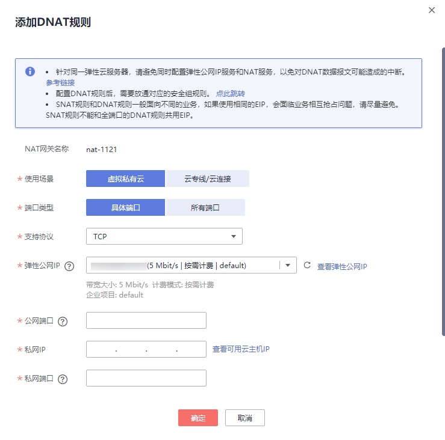

# 添加DNAT规则

## 操作场景

NAT网关创建后，通过添加DNAT规则，则可以通过映射方式将您VPC内的云主机对互联网提供服务。

一个云主机的一个端口对应一条DNAT规则，如果您有多个云主机需要为互联网提供服务，则需要创建多条DNAT规则。

## 操作前提

已成功创建NAT网关。

## 操作步骤

1.  登录管理控制台。
2.  在管理控制台左上角单击，选择区域和项目。
3.  在系统首页，单击“网络 \> NAT网关”。
4.  在NAT网关页面，单击需要添加DNAT规则的NAT网关名称。
5.  在NAT网关详情页面中，单击“DNAT规则”页签。
6.  在DNAT规则页签中，单击“添加DNAT规则”。

    **图 1**  添加DNAT规则  
    

    > **须知：**   
    >配置DNAT规则后，需要放通对应的安全组规则，否则DNAT规则不能生效。  

7.  根据界面提示，配置添加DNAT规则参数，详情请参见[表1](#zh-cn_topic_0127293986_table30787259144637)。

    **表 1**  DNAT规则参数说明

    
    <table><thead align="left"><tr id="zh-cn_topic_0127293986_row1287982144637"><th class="cellrowborder" valign="top" width="23.189999999999998%" id="mcps1.2.3.1.1">
<strong id="zh-cn_topic_0127293986_b64475021144748">参数</strong>

    </th>
    <th class="cellrowborder" valign="top" width="76.81%" id="mcps1.2.3.1.2">
<strong id="zh-cn_topic_0127293986_b37983896144751">说明</strong>

    </th>
    </tr>
    </thead>
    <tbody><tr id="zh-cn_topic_0127293986_row20452749101411"><td class="cellrowborder" valign="top" width="23.189999999999998%" headers="mcps1.2.3.1.1 ">
使用场景

    </td>
    <td class="cellrowborder" valign="top" width="76.81%" headers="mcps1.2.3.1.2 ">
虚拟私有云表示虚拟私有云中的云主机将通过DNAT的方式共享弹性公网IP，为公网提供服务。

    
云专线/云连接表示通过云专线或VPN方式接入虚拟私有云的本地数据中心中的服务器，将通过DNAT的方式访问公网。

    </td>
    </tr>
    <tr id="zh-cn_topic_0127293986_row1895714384610"><td class="cellrowborder" valign="top" width="23.189999999999998%" headers="mcps1.2.3.1.1 ">
端口类型

    </td>
    <td class="cellrowborder" valign="top" width="76.81%" headers="mcps1.2.3.1.2 ">
分为所有端口和具体端口两种类型。

    <ul id="ul410617281189"><li>所有端口：属于IP映射方式。此方式相当于为云主机配置了一个弹性公网IP，任何访问该弹性公网IP的请求都将转发到目标云服务器实例上。</li><li>具体端口：属于端口映射方式。NAT网关会将以指定协议和端口访问该弹性公网IP的请求转发到目标云主机实例的指定端口上。</li></ul>
    </td>
    </tr>
    <tr id="zh-cn_topic_0127293986_row13591056167"><td class="cellrowborder" valign="top" width="23.189999999999998%" headers="mcps1.2.3.1.1 ">
支持协议

    </td>
    <td class="cellrowborder" valign="top" width="76.81%" headers="mcps1.2.3.1.2 ">
协议类型分为TCP和UDP两种类型。端口类型为具体端口时，可配置此参数，端口类型为所有端口时，此参数默认设置为All。

    </td>
    </tr>
    <tr id="zh-cn_topic_0127293986_row43238809144637"><td class="cellrowborder" valign="top" width="23.189999999999998%" headers="mcps1.2.3.1.1 ">

    
弹性公网IP

    </td>
    <td class="cellrowborder" valign="top" width="76.81%" headers="mcps1.2.3.1.2 ">
弹性公网IP地址及公网端口。

    
这里只能选择没有被绑定的弹性公网IP，或者被绑定在当前NAT网关中非“所有端口”类型DNAT规则上的弹性公网IP，或者被绑定到当前NAT网关中SNAT规则上的弹性公网IP。

    </td>
    </tr>
    <tr id="zh-cn_topic_0127293986_row189841183384"><td class="cellrowborder" valign="top" width="23.189999999999998%" headers="mcps1.2.3.1.1 ">
公网端口

    </td>
    <td class="cellrowborder" valign="top" width="76.81%" headers="mcps1.2.3.1.2 ">
弹性公网IP的端口。当端口类型为具体端口时，需要配置此参数，有效数值为1-65535。

    
公网端口的范围可以为具体的数值，也可以为连续的数值范围，例如端口可以为80，也可以为80-100。

    </td>
    </tr>
    <tr id="zh-cn_topic_0127293986_row35593477144637"><td class="cellrowborder" valign="top" width="23.189999999999998%" headers="mcps1.2.3.1.1 ">
私网IP

    </td>
    <td class="cellrowborder" valign="top" width="76.81%" headers="mcps1.2.3.1.2 "><ul id="ul6112191010186"><li>当使用场景为虚拟私有云时，指云主机的IP地址。表示此IP地址的云主机将通过DNAT方式为公网提供服务。</li><li>当使用场景为云专线时，指用户本地数据中心中服务器的IP地址或者用户的私有IP地址。表示通过云专线或VPN接入到虚拟私有云的本地数据中心端的此私有IP服务器，可以通过DNAT方式为公网提供服务。</li><li>端口类型为具体端口时，需要配置私网IP的端口。</li></ul>
    </td>
    </tr>
    <tr id="zh-cn_topic_0127293986_row1423724123219"><td class="cellrowborder" valign="top" width="23.189999999999998%" headers="mcps1.2.3.1.1 ">
私网端口

    </td>
    <td class="cellrowborder" valign="top" width="76.81%" headers="mcps1.2.3.1.2 ">
在使用DNAT为云主机面向公网提供服务场景下，指云主机的端口号。当端口类型为具体端口时，需要配置此参数，有效数值为1-65535。

    
私网端口的范围可以为具体的数值，也可以为连续的数值范围，例如端口可以为80，也可以为80-100。

    </td>
    </tr>
    <tr id="row1629375132119"><td class="cellrowborder" valign="top" width="23.189999999999998%" headers="mcps1.2.3.1.1 ">
描述

    </td>
    <td class="cellrowborder" valign="top" width="76.81%" headers="mcps1.2.3.1.2 ">
DNAT规则信息描述。最大支持255个字符。

    </td>
    </tr>
    </tbody>
    </table>

8.  配置完成后，单击“确定”，可在DNAT规则列表中查看详情，若“状态”为“运行中”，表示创建成功。

